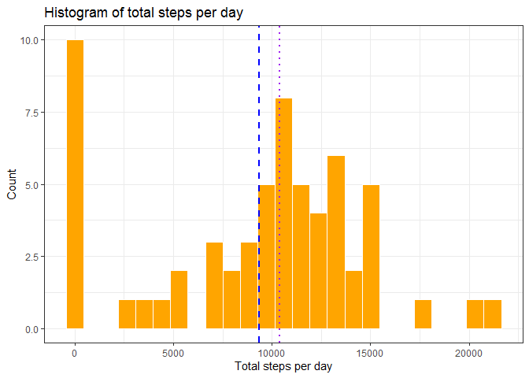
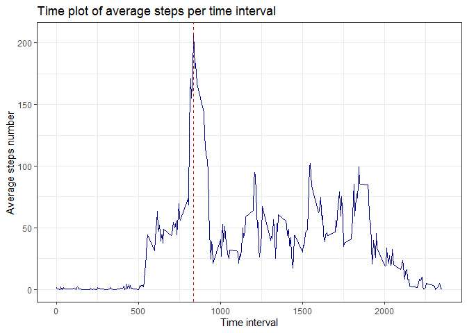
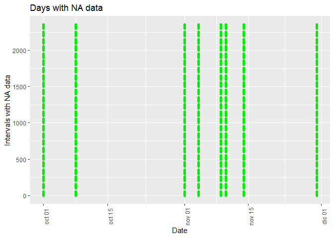
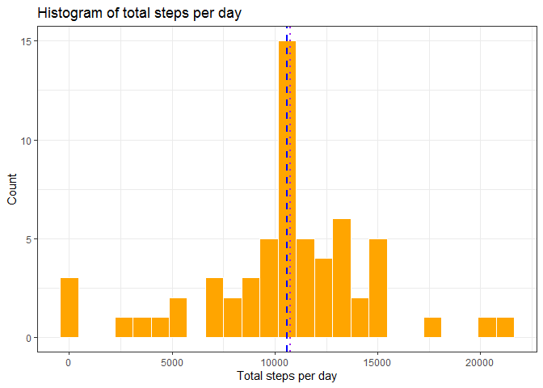
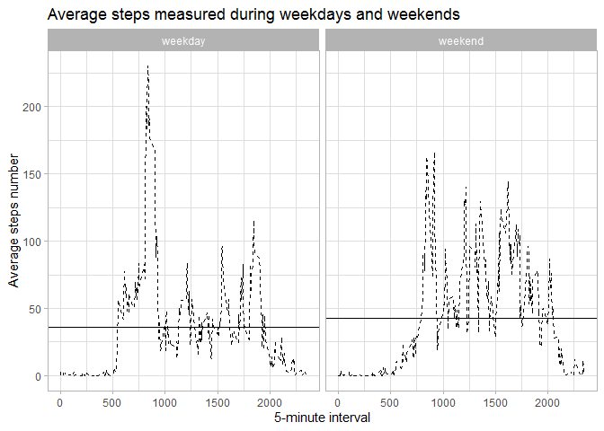

## Loading and preprocessing the data
The data provided was inside the repository in a file called "activity.zip"

The variables in the dataset are the following:

* **steps**: Number of steps taking in a 5-minute interval (missing values are coded as NA)
* **date**: The date on which the measurement was taken in YYYY-MM-DD format
* **interval**: Identifier for the 5-minute interval in which measurement was taken

the dataset is stored in a comma-separated-value (CSV) file and there are a total of 17,568 observations in this dataset.

- Unzip the data file


```r
unzip(zipfile = "activity.zip", files = "activity.csv", overwrite = TRUE)
```
- Load and store the datafile in a dataframe object called "activitydata"


```r
activitydata <-read.table(file = "activity.csv", header = TRUE, sep = ",", na.strings = "NA")

str(activitydata)
```

```
## 'data.frame':	17568 obs. of  3 variables:
##  $ steps   : int  NA NA NA NA NA NA NA NA NA NA ...
##  $ date    : Factor w/ 61 levels "2012-10-01","2012-10-02",..: 1 1 1 1 1 1 1 1 1 1 ...
##  $ interval: int  0 5 10 15 20 25 30 35 40 45 ...
```
It is important to notice that the *date* variable is stored as a *factor*, rather than a *date*. 
Let's change it to a more easy to handle format

```r
activitydata$date <- as.Date(x = activitydata$date, format = "%Y-%m-%d")
str(activitydata)
```

```
## 'data.frame':	17568 obs. of  3 variables:
##  $ steps   : int  NA NA NA NA NA NA NA NA NA NA ...
##  $ date    : Date, format: "2012-10-01" "2012-10-01" ...
##  $ interval: int  0 5 10 15 20 25 30 35 40 45 ...
```
In order to check the consistency, let's compute the number of *NA's* in the *steps* variable

```r
sum(is.na(activitydata$steps))
```

```
## [1] 2304
```
And the fraction of *NA's* is

```r
sum(is.na(activitydata$steps))/nrow(activitydata)
```

```
## [1] 0.1311475
```

## What is mean total number of steps taken per day?
Use the library *dplyr* for data manipulation


```r
library(dplyr)
```
And then, the variable *totalsteps* is defined as follows, removing the *NA's* in the dataset using **na.rm=TRUE**  

```r
totalsteps <- activitydata %>% group_by(date) %>%  summarize(total = sum(steps, na.rm = TRUE))
head(totalsteps)
```

```
## # A tibble: 6 x 2
##   date       total
##   <date>     <int>
## 1 2012-10-01     0
## 2 2012-10-02   126
## 3 2012-10-03 11352
## 4 2012-10-04 12116
## 5 2012-10-05 13294
## 6 2012-10-06 15420
```
By using the *ggplot2* package, it is easier to create a plot using the grammar of graphics

```r
library(ggplot2)
```
And the Histogram for Total Steps per day is the following

```r
totalsteps %>% ggplot(aes(x = total)) + 
  geom_histogram(color = "white" ,fill = "orange",bins = 25) + 
  geom_vline(xintercept = mean(totalsteps$total, na.rm=TRUE), color = "blue", lwd = 1, lty = 2) +
  geom_vline(xintercept = median(totalsteps$total, na.rm = TRUE), color = "purple", lwd = 1, lty=3) +
  ggtitle("Histogram of total steps per day") +
  ylab("Count") + 
  xlab("Total steps per day") +
  theme_bw()
```

<!-- -->

Where the dashed line is the mean and the dotted line the median, with values:

```r
meanq1 <- mean(totalsteps$total, na.rm = TRUE)
print(meanq1)
```

```
## [1] 9354.23
```

```r
medianq1 <- median(totalsteps$total, na.rm = TRUE)
print(medianq1)
```

```
## [1] 10395
```

**Technical note**: The main difference between a histogram and a barplot is that the histogram is a one-variable plot, showing distributions in a
simplistic fashion. A barplot, on the other hand, is a two-variable plot, in which we need to specify both x and y axis. In this example, the plot is showing a histogram of total steps done per day, with a huge number of measurements in zero showing total inactivity.
## What is the average daily activity pattern?
Firstly, the variable *intervalsteps* is created and assigned the values of the mean per interval 

```r
intervalsteps <- activitydata %>% group_by(interval) %>% summarize(average_interval = mean(steps, na.rm=TRUE))
```


```r
intervalsteps %>% ggplot(aes(x = interval, y = average_interval)) + 
  geom_line(color = "blue4", lwd = .5) + 
  geom_vline(xintercept = intervalsteps$interval[which.max(intervalsteps$average_interval)], color = "red3", lwd = .5, lty = 2) +
  ggtitle("Time plot of average steps per time interval") + 
  xlab ("Time interval") +
  ylab ("Average steps number") + 
  theme_bw()
```

<!-- -->

The 5-minute interval in which there are a maximun number of steps, on average, is 835 

## Imputing missing values
Firstly, let's compute the total number of missing values in the dataset

```r
sum(is.na(activitydata$steps))
```

```
## [1] 2304
```
By looking at the pattern of the intervals and range, it is clear that the structure of the interval number is an indication of the time at which the number of steps was taken.
For instace, *0* is 00:00 and *2355* is 23:55. For each day, there are 288 independent measurements.

It is mandatory then to see if these NA values are random scattered across days, or, for instance, entire days when data was not recorded.


```r
NAdays <- activitydata %>% filter(is.na(steps) == TRUE)

head(NAdays)
```

```
##   steps       date interval
## 1    NA 2012-10-01        0
## 2    NA 2012-10-01        5
## 3    NA 2012-10-01       10
## 4    NA 2012-10-01       15
## 5    NA 2012-10-01       20
## 6    NA 2012-10-01       25
```

```r
NAdays %>% ggplot(aes(x = date, y = interval)) + 
  geom_point(color = "green2") + 
  ggtitle("Days with NA data") + 
  xlab("Date") + 
  ylab("Intervals with NA data") + 
  theme(axis.text.x = element_text(angle = 90))
```

<!-- -->

It is clear, by looking at the plot, that those where days when no data was recorded at all. That is, 8 days.

The strategy for filling in all of the missing values will be as follow: Take the mean of the same interval and replace the NA with that value.


```r
activitydatafilled <- activitydata

x1 <- 1
x2 <- 1

for (x1 in 1:nrow(activitydatafilled)){
  if (is.na(activitydatafilled$steps[x1]) == TRUE){
    activitydatafilled$steps[x1] <- intervalsteps$average_interval[x2]
    x2 <- x2 + 1
    if (x2 >= 288){
      x2 <- 1
    }
  }
  else {
    x2 <- 1
  }
}

head(activitydatafilled)
```

```
##       steps       date interval
## 1 1.7169811 2012-10-01        0
## 2 0.3396226 2012-10-01        5
## 3 0.1320755 2012-10-01       10
## 4 0.1509434 2012-10-01       15
## 5 0.0754717 2012-10-01       20
## 6 2.0943396 2012-10-01       25
```

```r
head(activitydata)
```

```
##   steps       date interval
## 1    NA 2012-10-01        0
## 2    NA 2012-10-01        5
## 3    NA 2012-10-01       10
## 4    NA 2012-10-01       15
## 5    NA 2012-10-01       20
## 6    NA 2012-10-01       25
```

By plotting a histogram in a similar way as in exercise 1, it is possible to check whether if the new values have an impact in the mean and median

```r
totalstepsfilled <- activitydatafilled %>% group_by(date) %>%  summarize(total = sum(steps, na.rm = TRUE))
totalstepsfilled %>% ggplot(aes(x = total)) + 
  geom_histogram(color = "white" ,fill = "orange",bins = 25) + 
  geom_vline(xintercept = mean(totalstepsfilled$total, na.rm=TRUE), color = "blue", lwd = 1, lty = 2) +
  geom_vline(xintercept = median(totalstepsfilled$total, na.rm = TRUE), color = "purple", lwd = 1, lty=3) +
  ggtitle("Histogram of total steps per day") +
  ylab("Count") + 
  xlab("Total steps per day") +
  theme_bw()
```

<!-- -->

And the differences in the mean and median for this question are the following:

```r
meanq3 <- mean(totalstepsfilled$total, na.rm = TRUE)
print(meanq3) #mean of filled dataset
```

```
## [1] 10766.25
```

```r
print(meanq1) #mean of dataset with NA's
```

```
## [1] 9354.23
```

```r
medianq3 <- median(totalstepsfilled$total, na.rm = TRUE)
print(medianq3) #median of filled dataset
```

```
## [1] 10766.83
```

```r
print(medianq1) #median of dataset with NA's
```

```
## [1] 10395
```
## Are there differences in activity patterns between weekdays and weekends?
Firstly, a factor variable must be created that indicates whether a given date is a weekday or weekend


```r
activitydatafilledday <- activitydatafilled

weekday <- c("lunes", "martes", "miércoles", "jueves", "viernes")
weekend <- c("sábado", "domingo")

activitydatafilledday$weekday <- weekdays(activitydatafilledday$date)

for (i in 1:nrow(activitydatafilledday)){
  if (activitydatafilledday$weekday[i] %in% weekday){
    activitydatafilledday$weekday[i] <- "weekday"
  }
  else {
    activitydatafilledday$weekday[i] <- "weekend"
  }
}

activitydatafilledday$weekday <- as.factor(activitydatafilledday$weekday)
```

And then a panel plot is created. In order to check differences in means, a new dataframe is created to store the mean values and plot them as well

```r
#data wrangling
activitydatafilleddayfinal <- activitydatafilledday %>% 
  group_by(weekday, interval) %>% 
  summarise(avg_steps = mean(steps))


#mean_days stores the step means per factor
mean_days <- activitydatafilledday %>% 
  group_by(weekday) %>% 
  summarise(avg_steps = mean(steps))

#final plot
activitydatafilleddayfinal %>% ggplot(aes(x = interval, y = avg_steps)) +
  geom_line(color="black", lty = 2, lwd = .5) +
  ggtitle("Average steps measured during weekdays and weekends") + 
  ylab("Average steps number") +
  xlab("5-minute interval") +
  facet_wrap(~weekday) + 
  geom_hline(data = mean_days, aes(yintercept = avg_steps)) +
  theme_light()
```

<!-- -->

##Conclusions

Finally, it is clear that there are some difference between weekdays and weekends. 

* The highest number during weekdays is in the morning, around 08:35. Depending on the country in which this data was taken, that could show people commuting to their jobs. After that peak, the steps number is relatively low, meaning that they started their daily job. 
* The time interval clearly shows at what time the average person starts their day: during weekdays, at around 05:00. During weekends, around 07:30.
* The overall shape of the plots may suggest that people walk more during weekdays than during weekends: By putting the mean of each day on the each plot, we can see that in reality the mean is higher for weekends. The number of steps is consistently higher due to many factors, such as hiking, walking to grocery stores, among others.
